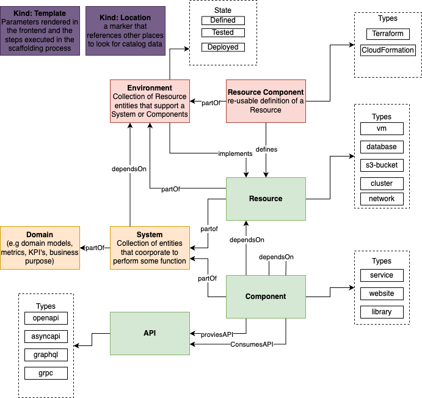

# Backstage IaC Plugin
I wished to extend the Entity Model use in Backstage to support first class entities that represented IaC environments and modules.

I planned to extend the model as per this diagram, adding the Environment and ResourceComponent entities:

The Environment entity being analogous to the System entity, and the ResourceComponent analogous to the Component. That is having IaC equivalents of the existing, software-centred, entities.  

I found the docs at https://backstage.io/docs/features/software-catalog/extending-the-model#implementing-custom-model-extensions to be very difficult to follow, especially in terms of connecting the dots on all the pieces that need to be configured. Hopefully this will find an audience that want the same capability, but also help people understand what is needed to extend the Backend model. <3

### Prerequsites

You must have a Backstage app running. If not you can create one with `npx @backstage/create-app` command

### Folders

* iac-support-common - contains the definition of the Environment and ResourceComponent entities, extremely simplified. This was built by looking at the https://github.com/backstage/backstage/tree/master/packages/catalog-model/src/kinds and https://github.com/backstage/backstage/tree/master/packages/catalog-model/src/schema code for the existing entities
* iac-support-backend - contains the validation logic used by Backstage to ensure our entities work correctly, and generate teh right relation lines. Again, I use the processors in these folders to help, but the best pointer I got was from the Backstage Discord support bods and the creation of the doEmit function.

### Using

1. Go to the  root directory of the Backstage app you created (the default is the backstage dir, so I'll use that as a reference here).
2. Type `yarn --cwd packages/backend add @paulpogo/plugin-iac-support-backend` to install the plugin. Ensure that the plugin has installed by ensuring you see the following 
```success Saved lockfile.
success Saved 3 new dependencies.
info Direct dependencies
info All dependencies
├─ @paulpogo/plugin-iac-support-backend@1.0.0
├─ @paulpogo/plugin-iac-support-common@1.0.0
└─ app@0.0.0
✨  Done in 13.49s. 
```

3. Modify packages/backend/src/plugins/catalog.ts to include a reference to our new processor:
   ```
   import ....
   import { ScaffolderEntitiesProcessor } from '@backstage/plugin-catalog-backend-module-scaffolder-entity-model';
   import { IacSupportEntitiesProcessor } from '@paulpogo/plugin-iac-support-backend';
   import ....
   
   export default async function createPlugin(
     env: PluginEnvironment,
   ): Promise<Router> {
     const builder = await CatalogBuilder.create(env);
     builder.addProcessor(new ScaffolderEntitiesProcessor());
     builder.addProcessor(new IacSupportEntitiesProcessor());
     ......
   }

    ```

4. In app-config.yaml, add the following entities to the catalog/rules/allow list:
    ```
    catalog:
    import:
        entityFilename: catalog-info.yaml
        pullRequestBranchName: backstage-integration
    rules:
        - allow: [...., Group, Domain, Environment, ResourceComponent, Template]
    ```

5. Fire up Backstage `yarn dev`

### Ready to go

At this point, assuming everything worked correctly, you should be able to add your needed Environment and ResourceComponent entities as needed.
See the example repo I have created to demonstrate the plugin use,  https://github.com/pogo61/ecs-cluster-terraform, for hints on how this could work for you.

**Note: the new entities will not show up in your "Home" page Component drop-down list until you create at least one of them**

**Please look out for a [Medium Article](https://medium.com/@paulpogonoski/backstage-iac-support-392f34ea118e) that describes using this in detail**
